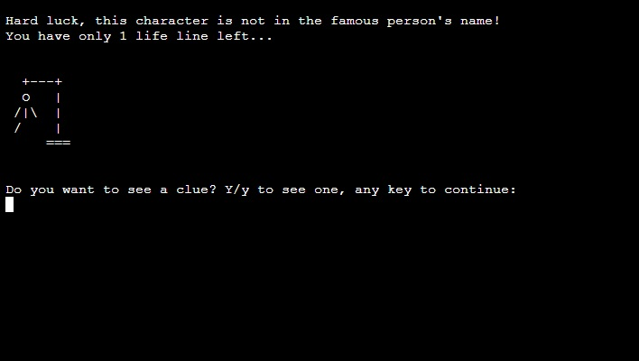

<!--- Python terminal game -->
# Guess Famous Person (Hangman Game)

<!--- Game overview -->
Guess the Famous Person (Hangman Game) is a python terminal game, which runs in the Code Institute mock terminal on Heroku. 

Users can try to figure out who the random famous person is chosen by the computer. They must try to guess the characters that are in the name and reveal who the person is. This is a fun game for all of the family and friends to play. This is the kind of game that users can play during the Christmas holidays and other get-togethers to keep themselves entertained. It suits everyone too, as there are a number of categories to choose from. The user can choose the category that they like best, e.g. Sport or Music etc. They then try to guess the person by entering the characters they feel the name could contain. Six lifelines are available to the user. Once the game is over, either after a win or a loss, the player can play again or end the game, enjoy!

[The live link can be found here](https://guess-famous-person.herokuapp.com/) 
<!--- Responsive design image -->

    

<!--- Outline how to play the game -->
# How to play

<!--- Main Menu image -->

    

  - Guess the Famous Person (Hangman Game) is based on the classic pen-and-paper hangman game. You can read more about it on [Wikipedia](https://en.wikipedia.org/wiki/Hangman_(game))

  - In this version the user has to guess a random famous person's name rather than a word 

  - There are 5 categories to choose from: Sport, Music, Movies, Authors and General Knowledge

  - Once a valid category is chosen the game begins

  - The user has six lifelines, i.e. they are allowed to make five wrong guesses, the game ends if the user makes a sixth wrong guess

  - If the user correctly guesses the characters in the famous person's name, they win the game

<!--- Outline the features of the game -->
# Features

## Existing Features

- __Random Name Generation__

    - Once a category is chosen a random famous person's name is generated from that category

    - The player then has to figure out who this person is by guessing characters they think are in the name

    - When the player has only one lifeline left they are asked if they want to see a clue

    - Accepts user input

<!--- Clue image -->

    

    - Accepts user input

    