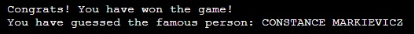
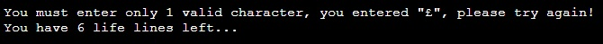

<!--- Python terminal game -->
# Guess Famous Person (Hangman Game)

<!--- Game overview -->
Guess the Famous Person (Hangman Game) is a python terminal game, which runs in the Code Institute mock terminal on Heroku. 

Players try to figure out who the random famous person is chosen by the computer. They must try to guess the characters that are in the name and reveal who the person is. This is a fun game for all of the family and their friends to play. This is the kind of game that users can play during the Christmas holidays and other get-togethers to keep themselves entertained. It suits everyone too, as there are a number of categories to choose from. The player can choose the category that they like best, e.g. Sport or Music etc. They then try to guess the person by entering the characters they feel the name could contain. Six lifelines are available to the player. Once the game is over, either after a win or a loss, the player can play again or end the game, enjoy!

[The live link can be found here](https://guess-famous-person.herokuapp.com/) 
<!--- Responsive design image -->

    

<!--- Outline the user interface design principles -->
# User Interface Design

As the designer of the hangman game, I aimed to have a finished application that is consistent, predictable, useful, intuitive and good fun to play. It should also be easily learnable. The menu/screens should be self explanatory and not confuse the user. The key principle and theme of the game is to provide the player with the following information and keep the player informed at all times:

- What does the game involve?
- How do you play the game?
- How do you win the game?
- How do you lose the game?

<!--- Main Menu image -->

    

<!--- Outline the user/site goals -->
# User / Site Goals

- Clear the terminal when appropriate, I imported the os library to implement this requirement
- Consistency of user messages provided to the player
- Highlight to the player when they have made an invalid choice
- Highlight to the player when they have entered an invalid character
- Keep the player informed of how many lifelines they have left 
- Keep the player informed of what characters they have guessed already
- Provide the player with a clue when they have only one lifeline left
- Inform the player when they have won
- Inform the player when they have lost
- Ask the player if they want to play again

<!--- Outline how to play the game -->
# How to play

  - Guess the Famous Person (Hangman Game) is based on the classic pen-and-paper hangman game. You can read more about it on [Wikipedia](https://en.wikipedia.org/wiki/Hangman_(game))
  - In this version the player has to guess a random famous person's name rather than a word 
  - There are 5 categories to choose from: Sport, Music, Movies, Authors and General Knowledge
  - Once a valid category is chosen the game begins
  - The player has six lifelines, i.e. they are allowed to make five wrong guesses, the game ends if the player makes a sixth wrong guess
  - If the player correctly guesses all of the characters in the famous person's name, they win the game

<!--- Outline the features of the game -->
# Features

## Existing Features

- __Random Name Generation__
    - Once a category is chosen a random famous person's name is generated from that category, I imported the random library to implement this requirement
    - The player then has to figure out who this person is by guessing characters they think are in the name

<!--- Sport image -->

    

- __Correct Guess__
    - If the character guessed by the player is correct, the player is informed of this 

<!--- Correct guess image -->

    

- __Incorrect Guess__
    - If the character guessed by the player is incorrect, the player is informed of this 

<!--- Incorrect guess image -->

    

- __Guessed Characters__
    - All of the guessed characters (correct and incorrect), are displayed for the player 

<!--- Guessed characters image -->

    

- __Display Lifelines__  
    - When the player is playing the game, the number of lifelines left are displayed
    - This ensures the player knows how many more wrong guesses they are allowed to make

<!--- Lifelines image -->

    

- __Display Hangman Image__  
    - When the player is playing the game, the hangman image is also displayed
    - This provides a visual image to the player of how many more wrong guesses they are allowed to make

<!--- Hangman image -->

    

- __Provide a Clue__  
    - When the player has only one lifeline left they are asked if they want to see a clue
    - If they answer "Y/y", a clue is provided

<!--- Clue image -->

    

<!--- Clue image 1 -->

    

- __Win the Game__  
    - When the player has guessed correctly all of the characters in the name, they have won the game

<!--- Won image -->

    

- __Lose the Game__  
    - When the player has run out of lifelines, they have lost the game

<!--- Lose image -->

    

- __Play Again__  
    - When the player has finished the game, they are asked if they want to play again

<!--- Play again image -->

    

## Input Validation and Error-Checking

- __Menu Options__
    - The menu option entered must be from 1 to 5 or 99 to exit
    - An invalid character cannot be entered, only numbers are accepted
    
<!--- Invalid menu image 1 -->

    

<!--- Invalid menu image 2 -->

    

- __Game Characters Entry__
    - The game characters entered must be alpha characters, A-Z or "." or "'"
    - Some names can contain a period character or a single quote, e.g. J. K. Rowling, Seán O'Casey
    - Only one character can be entered at a time

<!--- Invalid game image 1 -->

    

<!--- Invalid game image 2 -->

    

   
    
<!--- Invalid game image 3 -->

    

## Future Features

- Include more than 5 categories 
- At the moment the famous names in the game are hard coded in the program, in the future these names should come from a data source like a database or a spreadsheet 
- Include a feature like: easy, medium and hard options in the game, which would include giving more clues as the player loses lifelines

<!--- Outline the data model used for the game -->
# Data Model

I decided to use Python dictionaries as my primary data model.

Each of the 5 categories in the game were set-up as a separate dictionary. The reason that I chose to use dictionaries was so that I could have a clue associated with each name. 

Therefore, this enhanced the speed and efficiency of retrieving the famous person's name and clue from the dictionary. 

I also used Python lists to store the game categories and hangman pictures, again for ease of access.

<!--- Outline the data flow diagrams used for the game -->
# Data Flow Diagrams

    

    

<!--- Outline my testing -->
# Testing

I have manually tested this application by doing the following: 

- I entered a category number not in the list, I received the expected error message
- I entered invalid characters when choosing a category, I received the expected error message
- I entered invalid characters when entering a name character, I received the expected error message
- I entered the same character twice when entering a name character, I received the expected error message
- I entered more than one character when entering a name character, I received the expected error message
- I tested that my application works in different browsers: Microsoft Edge, Google Chrome and Mozilla Firefox

<!--- Microsoft Edge, Google Chrome and Mozilla Firefox images -->
Microsoft Edge

    

Google Chrome

    

Mozilla Firefox

  

## Bugs

### Solved Bugs

- I had to use a time delay when displaying the menu options error messages. As I was clearing the screen, the error message was not displaying, I included a 2 second pause to allow the error message to display on the screen. I imported the time library to implement this requirement 
- I noticed that when I deployed my project the output was too close to the left hand edge of the terminal screen, I had to include a space character to move the output to the right slightly 
- I also noticed when I deployed my project the output was too close to the top of the terminal screen, I had to include a carriage return to move the output down one line 
- I had to remember that my dictionaries and lists used zero indexing. I was selecting the wrong category until I subtracted one from my index variable  

### Remaining Bugs

- No bugs remaining

### Validator Testing

- PEP8
  - No errors were returned from PEP8 [Python Validator](https://pep8ci.herokuapp.com/)

<!--- PEP8 image -->

    

<!--- Outline the deployment procedure -->
# Deployment

This project was deployed using Code Institute's mock terminal for Heroku.

- Steps for deployment:
  - Fork or clone this repository (see below)
  - Create a new Heroku app
  - Add a Config Var: The key is PORT and the value is 8000
  - Set the buildpacks to Python and NodeJS in that order
  - Link the Heroku app to the repository
  - Click on Deploy

### Steps to [Clone](https://docs.github.com/en/repositories/creating-and-managing-repositories/cloning-a-repository) or [Fork](https://docs.github.com/en/get-started/quickstart/fork-a-repo) this repository

To Clone:
1. On GitHub.com, navigate to the main page of the repository.
2. Above the list of files, click Code.
3. Copy the URL for the repository.
4. Open Git Bash.
5. Change the current working directory to the location where you want the cloned directory.
6. Type git clone, and then paste the URL you copied earlier.
7. Press Enter to create your local clone.

To Fork:
1. On GitHub.com, navigate to the octocat/Spoon-Knife repository.
2. In the top-right corner of the page, click Fork.
3. Select an owner for the forked repository.
4. By default, forks are named the same as their parent repositories.
5. Optionally, add a description of your fork.
6. Choose whether to copy only the default branch or all branches to the new fork.
7. Click Create fork.

<!--- List the credits -->
# Credits 

I would like to say thanks to Chris Quinn, who was my mentor for this project. He provided me with a lot of valuable knowledge and gave me the idea to create a hangman game.

## Content

- Code Institute for the deployment terminal
- Wikipedia for the details of the hangman game
- The idea to use the "try: except" validation routine for the menu options was based on Code Institute's Love Sandwiches walkthrough project and modified to suit the needs of this application 
- The hangman pictures list was taken from [Invent with Python](https://inventwithpython.com/)

  

    