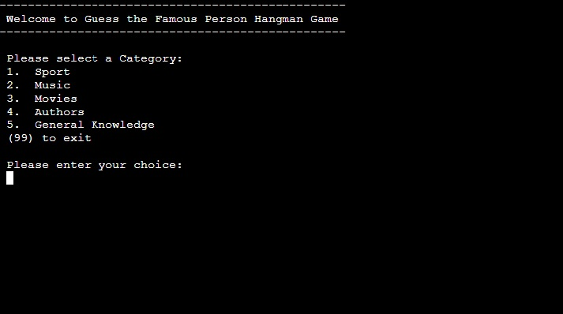

<!--- Python terminal game -->
# Guess Famous Person (Hangman Game)

<!--- Game overview -->
Guess the Famous Person (Hangman Game) is a python terminal game, which runs in the Code Institute mock terminal on Heroku. 

Players try to figure out who the random famous person is chosen by the computer. They must try to guess the characters that are in the name and reveal who the person is. This is a fun game for all of the family and their friends to play. This is the kind of game that users can play during the Christmas holidays and other get-togethers to keep themselves entertained. It suits everyone too, as there are a number of categories to choose from. The player can choose the category that they like best, e.g. Sport or Music etc. They then try to guess the person by entering the characters they feel the name could contain. Six lifelines are available to the player. Once the game is over, either after a win or a loss, the player can play again or end the game, enjoy!

[The live link can be found here](https://guess-famous-person.herokuapp.com/) 
<!--- Responsive design image -->

    

<!--- Outline how to play the game -->
# How to play

<!--- Main Menu image -->

    

  - Guess the Famous Person (Hangman Game) is based on the classic pen-and-paper hangman game. You can read more about it on [Wikipedia](https://en.wikipedia.org/wiki/Hangman_(game))

  - In this version the player has to guess a random famous person's name rather than a word 

  - There are 5 categories to choose from: Sport, Music, Movies, Authors and General Knowledge

  - Once a valid category is chosen the game begins

  - The player has six lifelines, i.e. they are allowed to make five wrong guesses, the game ends if the player makes a sixth wrong guess

  - If the player correctly guesses all of the characters in the famous person's name, they win the game

<!--- Outline the features of the game -->
# Features

## Existing Features

- __Random Name Generation__

    - Once a category is chosen a random famous person's name is generated from that category

    - The player then has to figure out who this person is by guessing characters they think are in the name

<!--- Sport image -->

    

- __Correct Guess__

    - If the character guessed by the player is correct, the player is informed of this 

<!--- Correct guess image -->

    

- __Incorrect Guess__

    - If the character guessed by the player is incorrect, the player is informed of this 

<!--- Incorrect guess image -->

    

- __Guessed Characters__

    - All of the guessed characters (correct and incorrect), are displayed for the player 

<!--- Guessed characters image -->

    

- __Display Lifelines__
  
    - When the player is playing the game, the number of lifelines left are displayed

    - This ensures the player knows how many more wrong guesses they are allowed to make

<!--- Lifelines image -->

    

- __Display Hangman Image__
  
    - When the player is playing the game, the hangman image is also displayed

    - This provides a visual image to the player of how many more wrong guesses they are allowed to make

<!--- Hangman image -->

    

- __Provide a Clue__
  
    - When the player has only one lifeline left they are asked if they want to see a clue

    - If they answer "Y/y", a clue is provided

<!--- Clue image -->

    

<!--- Clue image 1 -->

    

- __Win the Game__
  
    - When the player has guessed correctly all of the characters in the name, they have won the game

<!--- Won image -->

    

- __Lose the Game__
  
    - When the player has run out of lifelines, they have lost the game

<!--- Lose image -->

    

- __Play Again__
  
    - When the player has lost the game, they are asked if they want to play again

<!--- Play again image -->

    

    

    

  

    